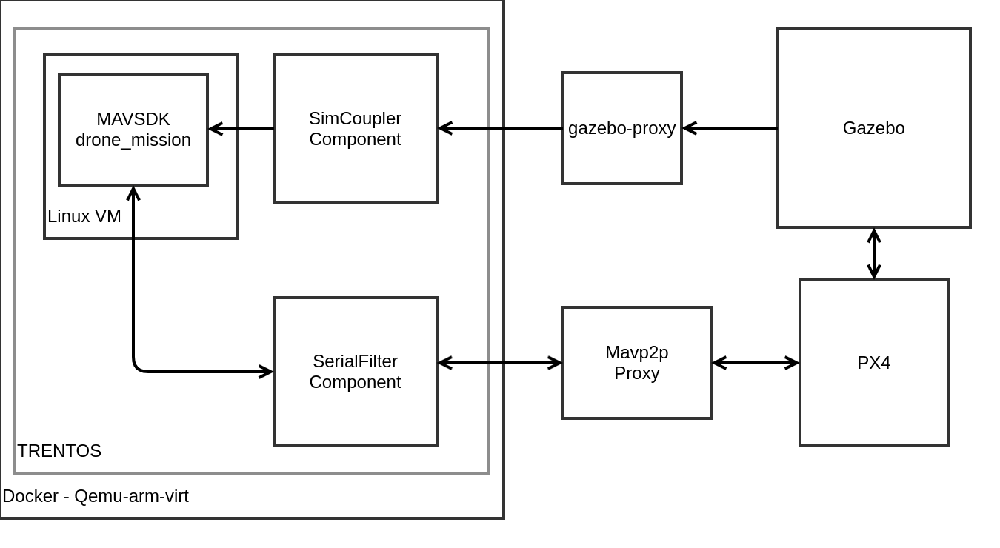

# Drone Sim Demo SITL
demo_trentos_drone_sim showcases the networking and virtualization features of TRENTOS:
This demo contains of three major components, a LinuxVM running on the CamkesVMM in TRENTOS.
Inside the LinuxVM a drone Mission script based on MAVSDK emits MAVLink commands sending the drone on a mission with waypoints.
The TRENTOS SerialFilter component is responsible to relay the MAVLink commands emitted from the LinuxVM to the PX4-Flightcontroller running on the host system.
This is done in both directions. MAVLink commands emitted from the LinuxVM are filtered against a filter set and a geofence blocking potentially malicious commands emitted by a potentially infiltrated system.
The SimCoupler component relays Sensor data emitted by the Gazebo simulator. These sensor could a camera, gps, air pressure etc. in our case a gps sensor is used as example. To retrieve the sensor data from gazebo a small proxy (gazebo proxy) must run on the host, which sends the sensor data to the TRENTOS docker container.

Unfortunately does MAVSDK sometimes run into some issue, including a rare segfault condition and some unhandled errors. This sometimes requires multiple launches of the demo to complete successfully.


### This demo consists of the following components:



- Gazebo Simulator (OSS) (Simulates a Quadcopter)       | host system
- Px4 Flight Controler (OSS)                            | host system
- Mavp2p (Mavlink Proxy)                                | host system
- gazebo_proxy (Gazebo sensor proxy)                    | host system
- SerialFilter (Filters and forwards mavlink messages)  | Qemu(Trentos(SerialFilter))
- SimCoupler (Forwards sensor data)                     | Qemu(Trentos(SimCoupler))
- LinuxVM (Buildroot linux)                             | Qemu(Trentos(CamkesVMM(Linux)))
- drone_mission                                         | Qemu(Trentos(CamkesVMM(Linux(drone_mission))))

These components together allow for the control of a simulated drone. 

---

## Installation of the components
The demonstration is developed on Ubuntu22.04, but should run fine under 20.04 as well.

### Gazebo
[Gazebo instructions](https://docs.px4.io/main/en/sim_gazebo_gz/)

The gazebo repository must be added to apt and the gz-garden binary be installed.

```sh
sudo wget https://packages.osrfoundation.org/gazebo.gpg -O /usr/share/keyrings/pkgs-osrf-archive-keyring.gpg
echo "deb [arch=$(dpkg --print-architecture) signed-by=/usr/share/keyrings/pkgs-osrf-archive-keyring.gpg] http://packages.osrfoundation.org/gazebo/ubuntu-stable $(lsb_release -cs) main" | sudo tee /etc/apt/sources.list.d/gazebo-stable.list > /dev/null
sudo apt-get update
sudo apt-get install gz-garden
```

### PX4-Autopilot
(PX4 instructions)[https://docs.px4.io/main/en/dev_setup/building_px4.html]

The PX4-Autopilot repository must be cloned. The project is compiled when launched.

```sh
git clone https://github.com/PX4/PX4-Autopilot.git --recursive
```

### Mavp2p
Download and install mavp2p
(Current release)[https://github.com/bluenviron/mavp2p/releases/latest/]

```sh
wget -qO- https://github.com/bluenviron/mavp2p/releases/download/v1.0.0/mavp2p_v1.0.0_linux_amd64.tar.gz | sudo tar -xz -C /usr/local/bin
```

### Gazebo Proxy
This programm is part of the TRENTOS_SDK

```sh
cd <trentos_sdk>/sdk/tools/gazebo_proxy
```

---

## Launching of the demonstrator:
Four different shell sessions should be started and the following command be executed in order.

1. PX4 (launches gazebo)
2. mavp2p
3. gazebo_proxy
4. trentos(demo_vm_drone_sim)


### Px4 & Gazebo
The gazebo instance is started and configured by the px4 flight controler.

```sh
cd PX4-Autopilot
export PX4_HOME_LAT=48.05502700126609
export PX4_HOME_LON=11.652206077452211
make px4_sitl gz_x500
```

### Mavp2p Proxy
This proxy is required to tunnel the connection from the docker network to the local network.
Otherwise a connection between the SerialFilter and Px4 cannot be established without applying new iptables rules.
The former part of the ip needs to be the system running the PX4-Flightcontroller, in this case its localhost.
The latter part if the ip of the docker container running TRENTOS, this **can vary between systems**!

```sh
mavp2p udps:127.0.0.1:14550 udpc:172.17.0.2:7000
```

### Gazebo Proxy
Collects sensor data form gazebo and sends them to the specified ip in JSON notation.
In our case the specified ip should be the trentos docker container with the port 5555.
The trentos docker container ip **can vary between systems**!

```sh
./run_proxy.sh 172.17.0.2:5555 -v /navsat
```

### Demo vm drone sim
This launches the trentos demo. This demo includes the `SerialFilter`, `SimCoupler` components as well as the linux guest system.


#### SDK
Build the demo:
```sh
sdk/scripts/open_trentos_build_env.sh \
    sdk/build-system.sh \
    sdk/demos/demo_vm_drone_sim \
    zynqmp \
    build-zynqmp-Debug-demo_vm_drone_sim \
    -DCMAKE_BUILD_TYPE=Debug
```

Run the demo:
```sh
cd build-zynqmp-Debug-demo_vm_drone_sim
../sdk/scripts/open_trentos_test_env.sh ./simulate
```

#### Seos_tests
```sh
cd <trentos sdk folder>
src/build.sh build-and-test demo_vm_drone_sim -d '-p 7000:7000'
```